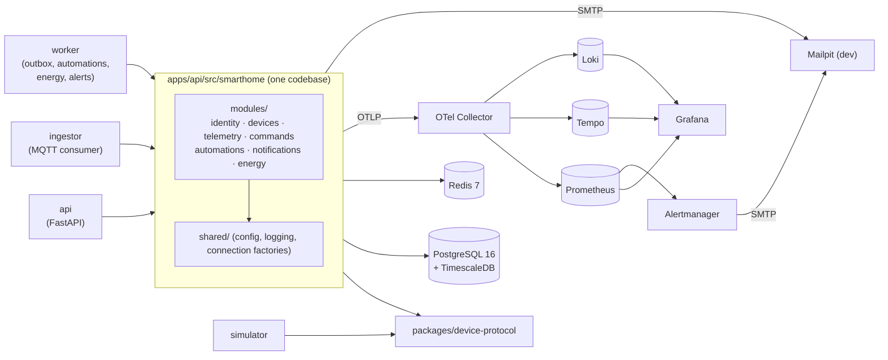

# Smart Home Hub

A multi-tenant smart home hub built to show **event-driven design, real-time
telemetry, time-series storage, device security and observability**. Real hardware
is optional: a simulator speaks the same MQTT protocol a real ESP32 would.

> **Status:** all 11 phases done. Next: a real ESP32 on the same protocol.
> [Architecture](docs/architecture.md) · [threat model](docs/security/threat-model.md) ·
> [ASVS](docs/security/asvs.md) · [ADRs](docs/adr/)
> [Versão em português](README.pt-BR.md).

## What it does

- Register and control devices: lights, plugs, thermostat, lock, presence, door/window,
  temperature/humidity, energy meter and a simulated camera.
- Ingest telemetry over MQTT 5 (TLS, per-device credentials and ACLs) into TimescaleDB.
- Keep a **digital twin** (desired/reported) per device, with command acks and timeouts.
- Run **automations** from a versioned JSON DSL, with loop protection and dry-run
  against history.
- Show a live SVG floor plan in a React PWA over WebSocket.
- Account **energy** per hour and device from meter counters, with exact time-of-use
  tariffs and a monthly budget.
- Raise **alerts** (device offline, low battery, budget) once per condition, into an
  inbox, email and signed webhooks, with quiet hours.
- Trace every action end to end: click → API → MQTT → device → ack → WebSocket.

## Architecture

A modular monolith with three entrypoints. See
[ADR 0001](docs/adr/0001-modular-monolith-with-multiple-entrypoints.md).



Module boundaries are enforced in CI by [import-linter](apps/api/.importlinter).
Containers, modules, where data lives and sequence diagrams for every main flow:
[docs/architecture.md](docs/architecture.md).
Every module owns one Postgres schema, with no foreign keys across schemas.

## Run it

Requirements: Docker with Compose v2, plus Python ≥ 3.12, Poetry ≥ 2.2 and Node ≥ 22
for local development.

```bash
make up          # builds and starts everything, waits for healthchecks
curl localhost:8000/health/ready
make down
```

| Service    | URL / port                     | Notes                                          |
|------------|--------------------------------|------------------------------------------------|
| API        | http://localhost:8000          | `/health/live`, `/health/ready`, `/docs`       |
| PostgreSQL | `localhost:15432`              | TimescaleDB 2.30, credentials in `.env`        |
| Redis      | `localhost:16379`              | password in `.env`                             |
| Web (dev)  | http://localhost:5173          | `make web-dev`, not containerised yet          |
| Keycloak   | http://localhost:8080          | realm `smarthome`; admin password in `.env`    |
| MQTT (TLS) | `localhost:8883`               | Mosquitto; dev CA in `infra/mqtt/certs/ca.crt` |
| Grafana    | http://localhost:3000          | anonymous viewer; admin password in `.env`     |
| Prometheus | http://localhost:9090          | OTLP receiver + exemplar storage, alert rules  |
| Alertmanager | http://localhost:9093        | operational alerts, emailed to Mailpit         |
| Mailpit    | http://localhost:8025          | catches every email the stack sends (SMTP 1025) |
| Tempo      | http://localhost:3200          | traces; metrics-generator → Prometheus         |
| Loki       | http://localhost:3100          | logs over native OTLP                          |
| OTel Collector | `localhost:4317` (gRPC), `localhost:4318` (HTTP) | single entry point for telemetry |

Host ports are offset from the defaults so the stack can run next to other local projects,
and listen on `127.0.0.1` only (`PUBLISH_HOST` in `.env`), except MQTT, which devices on
your LAN need. Override them in `.env`.

## Sign in

```bash
make up && make simulate     # in one terminal: the stack and a simulated fleet
make web-dev                 # in another: the web app, proxying /api (and its WebSocket) to the BFF
```

Open http://localhost:5173 and sign in. Dev users (password `smarthome-dev-1`):
`alice`, `bob`, `carol`, `dave`. Any of them can create a home and invite the others
as resident, guest (with expiry and device scope) or viewer. The simulated homes belong
to alice.

The web app shows each home as a **live floor plan**: rooms with their devices, updated
over a WebSocket as devices report. Select a device to control it, see its reported
state, latest readings, history chart and recent commands. The *Automations* tab edits
automations (with templates, server-side validation, a dry run over the last 24 h and
recent runs) and the *Scenes* tab activates scenes or captures one from the devices'
current state. It installs as a PWA. How it works:
[ADR 0011](docs/adr/0011-web-app-live-updates-and-typed-client.md).

How it works: the API is a **backend-for-frontend**. The browser only ever holds an
`HttpOnly; Secure; SameSite=Strict` session cookie, tokens stay server-side, refresh
tokens rotate, and unsafe requests need a CSRF token ([ADR 0003](docs/adr/0003-bff-sessions-and-csrf.md)).
Homes are tenants with per-home roles and a hash-chained, append-only audit log
([ADR 0004](docs/adr/0004-tenancy-roles-and-audit-log.md)).

## Simulated devices

```bash
make up
make simulate                     # first run pairs 3 homes x 20 devices, then runs them
make simulate SPEED=600           # a simulated day passes in 2.4 minutes
make simulate-reset               # forget the fleet; the next run pairs a new one
```

The first `make simulate` creates three homes owned by `alice`, with one pairing code
per device, and then **every simulated device pairs itself over HTTP**
(`POST /provisioning/claim`), the same way a real ESP32 would. Each device gets its own
broker credentials. Sign in as alice to see them; `GET /homes/{id}/devices` shows
presence (fed by the ingestor and the devices' Last Will) and each device's twin
([ADR 0006](docs/adr/0006-device-provisioning-credentials-and-twin.md)).

Telemetry is batched into a TimescaleDB hypertable with 1-minute, 1-hour and 1-day
continuous aggregates ([ADR 0007](docs/adr/0007-telemetry-in-timescaledb.md)):

```http
GET /homes/{home}/devices/{device}/telemetry?metric=power_w&from=2026-10-01T00:00:00Z
GET /homes/{home}/devices/{device}/readings/latest      # from Redis, never Timescale
```

Current state lives in Redis, history in TimescaleDB, configuration in Postgres
([ADR 0008](docs/adr/0008-current-state-history-configuration.md)).

Devices speak [protocol v1](docs/device-protocol.md) over MQTT 5 + TLS, each with its own
credentials and an ACL limited to its own topics ([ADR 0005](docs/adr/0005-mqtt-broker-and-qos.md)).
The simulator models a day in each home: outdoor temperature, sunlight, residents coming
and going, lights following presence and darkness, a fridge compressor cycle, a washer run.
It also injects faults: dropped connections (seen through the Last Will), noisy readings,
malformed payloads and draining batteries.

## Commands

```http
POST /homes/{home}/devices/{device}/commands      {"action": "set_state", "desired": {"on": true}}
GET  /homes/{home}/devices/{device}/commands/{id} # pending → delivered → acknowledged | failed | timed_out
```

`POST` answers `202` at once: the command and its MQTT message are written in one
transaction (a **transactional outbox**), and the `worker` publishes it after commit,
woken by `NOTIFY` ([ADR 0009](docs/adr/0009-commands-outbox-and-trace-propagation.md)).
The device acks over MQTT and the ingestor records the outcome; a command nobody answers
by its deadline (`ttl_s`, default 30 s) is marked `timed_out`, and a late answer cannot
change that. Locks and cameras need `operate_locks` and a sign-in from the last
5 minutes, otherwise the API returns `401` with a `login_url` that forces a fresh login.

Every command has a `trace_id`. With the simulator running, open it in Tempo and you see
one trace across four services: the API request, the worker's publish, the device
handling the command and the ingestor receiving its acks.

## Automations

```http
POST /homes/{home}/automations           {"name": "Hall light", "definition": {...}}
POST /homes/{home}/automations/dry-run   {"definition": {...}, "from": "2026-10-01T00:00:00Z"}
POST /homes/{home}/scenes/{id}/activate
GET  /automations/schema                 # JSON Schema of the DSL, for editors
```

Automations are JSON documents ([DSL v1](docs/automations.md)): triggers on telemetry,
twin properties, presence or the clock (in the home's time zone, DST included), with
optional holds (`for_s`: "no motion for 5 minutes"); conditions; and commands or scenes
as actions. Triggers are edge-triggered and every firing is recorded as a run with a
`trace_id`.

The ingestor publishes what changed to a **Redis stream**; the `worker` reads it with a
consumer group, so replicas share the work and a redelivered event never runs an
automation twice ([ADR 0010](docs/adr/0010-automations-event-stream-and-loop-protection.md)).
Automations that would trigger each other forever are flagged when saved and
**suspended** at run time (causal chain depth and rate limits). Edits are versioned
(`If-Match`, full revision history), and the **dry run** replays up to a week of recorded
telemetry through the engine's own rules to show when an automation would have run.

With the simulator running, a motion reading, the automation it triggers, the command,
the device and its acks show up as one trace in Tempo.

## Energy

```http
GET /homes/{home}/energy/usage?from=…&to=…&bucket=hour|day   # kWh and cost, per bucket and per device
PUT /homes/{home}/energy/tariff                              # currency, price per kWh, time-of-use periods, monthly budget
```

Plugs and the whole-home meter report a cumulative `energy_wh_total`. The `worker` folds
the deltas into hourly consumption per device every minute, treating a counter that went
down as a reboot rather than negative energy, and recomputing recent hours so late or
redelivered readings land where they belong. Reports never touch raw telemetry, so a year
of daily buckets costs a few thousand rows
([ADR 0012](docs/adr/0012-energy-accounting-from-counters.md)).

Prices are exact: decimal strings in the API, `numeric` in Postgres, `Decimal` in
Python, rounded once to the currency's minor unit. Time-of-use periods (e.g. a weekday
evening peak) price each hour at its local rate. When a meter is present the home total
is the meter, the plugs are a breakdown, and the rest is reported as *unmetered*.

## Alerts and notifications

```http
GET  /homes/{home}/alerts?status=open|resolved     POST /homes/{home}/alerts/{id}/acknowledge
GET  /me/notifications                             POST /me/notifications/read-all
PUT  /homes/{home}/notification-preferences        # email on/off, minimum severity, quiet hours
PUT  /homes/{home}/webhook                         # owners: signed POSTs on every alert transition
```

A lock offline for more than 5 minutes, a battery under 15 %, a month past 80 % or 100 %
of its energy budget: each becomes **one** alert with a lifecycle (`pending → open →
resolved`), however often the condition flaps and however many workers see the event. A
partial unique index decides, not application code
([ADR 0013](docs/adr/0013-alerts-and-notifications.md)). Members get an inbox entry (and
the web app's bell updates over the live socket), email according to their preferences,
and the home's webhook receives a payload signed with HMAC-SHA256
([integration guide](docs/notifications.md)). Delivery is a queue with retries and
backoff; in development every email lands in Mailpit.

## Dashboards and operational alerts

Grafana ships four dashboards: **Service Overview** (RED metrics, traces, logs),
**Device Pipeline** (ingestion rate, latency, batching, back-pressure, event stream lag),
**Commands and Automations** (acks, timeouts, outbox, runs, live sockets) and **Energy and
Notifications** (rollup lag, alert transitions, delivery queue). Prometheus evaluates 14
alert rules (ingestion stalled, buffer near full, outbox backlog, consumer lag, dead
letters, API errors and latency…), unit-tested with `promtool test rules` in
`make check-infra`; Alertmanager emails them to Mailpit.

## Load test

```bash
make loadtest-ingest     # pairs 50 homes x 20 devices, runs them at 5x their rate for 5 min, prints a report
make loadtest-api        # k6: 20 signed-in members reading devices, history, energy, inbox
```

Results and method: [docs/load-test.md](docs/load-test.md).

## Security

[Threat model](docs/security/threat-model.md) (STRIDE per trust boundary, each mitigation
linked to its code or test, open risks ranked) and an
[OWASP ASVS 5.0 Level 2 self-assessment](docs/security/asvs.md). In short: tokens never
reach the browser, devices have their own credentials and ACLs, critical commands need a
fresh sign-in and are audited in a hash-chained log, webhooks are signed and cannot reach
internal addresses, and every dependency and image is scanned on each PR.

## End-to-end tests

```bash
make up && make simulate FAULTS=0   # the stack and a fleet that behaves
make web-dev                        # another terminal
make e2e                            # Playwright: sign in, live control, energy, alerts, isolation
```

A real browser goes through Keycloak, the BFF, the broker, simulated devices and the live
socket. CI runs the same on every PR ([ADR 0015](docs/adr/0015-testing-strategy.md)).

## Tour: follow one request through every signal

```bash
make up
make demo-traffic            # 2 minutes of mixed traffic: fast, slow and failing requests
curl -s localhost:8000/diagnostics/trace-demo   # returns the trace_id of this request
```

1. Open **Grafana → Smart Home → Service Overview** (http://localhost:3000). You will see
   request rate, 5xx ratio, p50/p95/p99 latency, in-flight requests, the DB pool and
   process CPU/memory.
2. On *Latency percentiles*, hover a dot (an **exemplar**) and click **View trace**. Tempo
   opens the exact request: `GET /diagnostics/trace-demo` → Redis `INCRBY` → Postgres
   `SELECT` → `diagnostics.simulated_work`.
3. In the trace view, click **Logs for this span**. Loki shows the log line emitted inside
   that request, matched by `trace_id`.
4. Go the other way: in *Warnings and errors*, expand a `trace_demo_failed` line and follow
   its `trace_id` link back to Tempo.
5. **Explore → Tempo → Service Graph** shows the dependency map derived from spans.

How it is wired: [ADR 0002](docs/adr/0002-observability-pipeline.md).

## Develop

```bash
make install     # poetry install in every Python app + npm ci
make check       # ruff, import-linter, mypy --strict, eslint, tsc, OpenAPI/TS types up to date
make gen-client  # after changing the API: re-export OpenAPI and regenerate the TS types
make check-infra # validates compose, collector, Prometheus (+ alert rule tests), Alertmanager, Tempo, Loki, dashboards
make test-unit   # no containers
make test-it     # real TimescaleDB, Redis, Mosquitto, Keycloak, Mailpit via Testcontainers
make e2e         # Playwright against the running stack (see above)
make help        # everything else
```

## Repository layout

```
apps/
  api/          FastAPI app + every domain module (the monolith)
  ingestor/     MQTT ingestion entrypoint over the same modules
  worker/       background entrypoint over the same modules
  simulator/    simulated homes and devices (depends only on device-protocol)
  web/          React + TypeScript (Vite)
packages/
  device-protocol/   MQTT topics and message schemas
  contracts/         OpenAPI document + TypeScript types generated from it
infra/          docker compose and service configs
e2e/            Playwright end-to-end tests
docs/           architecture, security, protocol, guides; adr/ holds the decision records (MADR)
scripts/        repo tooling (import contracts, OpenAPI export, load test)
```

## Roadmap

1. ✅ Foundation: monorepo, CI, compose, module boundaries
2. ✅ Observability: OTel Collector, Prometheus, Grafana, Tempo, Loki
3. ✅ Identity and auth: Keycloak, BFF, roles, guests, audit log
4. ✅ Device protocol and MQTT broker with TLS and ACLs, basic simulator
5. ✅ Devices and provisioning: pairing, credentials, twin, LWT
6. ✅ Telemetry: batched ingestion, hypertables, continuous aggregates
7. ✅ Commands: ack, timeout, idempotency, trace propagation over MQTT
8. ✅ Automations: DSL, rule engine, scenes, schedules, dry run
9. ✅ Frontend: live floor plan, automation editor, history, PWA
10. ✅ Energy, notifications, dashboards, alerts, load test
11. ✅ Architecture diagrams, API and testing ADRs, threat model, ASVS self-assessment, E2E

Next: firmware for a real ESP32 speaking the same protocol.
