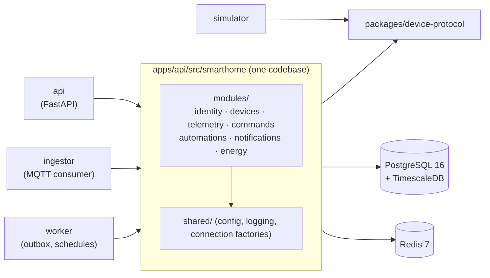

# Smart Home Hub

A multi-tenant smart home hub built to show **event-driven design, real-time
telemetry, time-series storage, device security and observability**. Real hardware
is optional: a simulator speaks the same MQTT protocol a real ESP32 would.

> **Status:** phase 1 of 11 (foundation). Most of the product below is still on the roadmap.
> [Versão em português](README.pt-BR.md).

## What it will do

- Register and control devices: lights, plugs, thermostat, lock, presence, door/window,
  temperature/humidity, energy meter and a simulated camera.
- Ingest telemetry over MQTT 5 (TLS, per-device credentials and ACLs) into TimescaleDB.
- Keep a **digital twin** (desired/reported) per device, with command acks and timeouts.
- Run **automations** from a versioned JSON DSL, with loop protection and dry-run
  against history.
- Show a live SVG floor plan in a React PWA over WebSocket.
- Trace every action end to end: click → API → MQTT → device → ack → WebSocket.

## Architecture (so far)

A modular monolith with three entrypoints. See
[ADR 0001](docs/adr/0001-modular-monolith-with-multiple-entrypoints.md).



Module boundaries are enforced in CI by [import-linter](apps/api/.importlinter).
Every module owns one Postgres schema, with no foreign keys across schemas.

## Run it

Requirements: Docker with Compose v2, plus Python ≥ 3.12, Poetry ≥ 2.2 and Node ≥ 22
for local development.

```bash
make up          # builds and starts everything, waits for healthchecks
curl localhost:8000/health/ready
make down
```

| Service    | URL / port                     | Notes                                          |
|------------|--------------------------------|------------------------------------------------|
| API        | http://localhost:8000          | `/health/live`, `/health/ready`, `/docs`       |
| PostgreSQL | `localhost:15432`              | TimescaleDB 2.30, credentials in `.env`        |
| Redis      | `localhost:16379`              |                                                |
| Web (dev)  | http://localhost:5173          | `make web-dev`, not containerised yet          |

Host ports are offset from the defaults so the stack can run next to other local projects.
Override them in `.env`.

## Develop

```bash
make install     # poetry install in every Python app + npm ci
make check       # ruff, import-linter, mypy --strict, eslint, tsc
make test-unit   # no containers
make test-it     # real TimescaleDB + Redis via Testcontainers
make help        # everything else
```

## Repository layout

```
apps/
  api/          FastAPI app + every domain module (the monolith)
  ingestor/     MQTT ingestion entrypoint over the same modules
  worker/       background entrypoint over the same modules
  simulator/    simulated homes and devices (depends only on device-protocol)
  web/          React + TypeScript (Vite)
packages/
  device-protocol/   MQTT topics and message schemas
  contracts/         OpenAPI + generated TS client
infra/          docker compose and service configs
docs/adr/       architecture decision records (MADR)
scripts/        repo tooling (import contract generator)
```

## Roadmap

1. ✅ Foundation: monorepo, CI, compose, module boundaries
2. Observability: OTel Collector, Prometheus, Grafana, Tempo, Loki
3. Identity and auth: Keycloak, BFF, roles, guests, audit log
4. Device protocol and MQTT broker with TLS and ACLs, basic simulator
5. Devices and provisioning: pairing, credentials, twin, LWT
6. Telemetry: batched ingestion, hypertables, continuous aggregates
7. Commands: ack, timeout, idempotency, trace propagation over MQTT
8. Automations: DSL, rule engine, scenes, schedules, dry run
9. Frontend: live floor plan, automation editor, history, PWA
10. Energy, notifications, dashboards, alerts, load test
11. Diagrams, remaining ADRs, threat model, ASVS checklist, E2E. Then a real ESP32.
