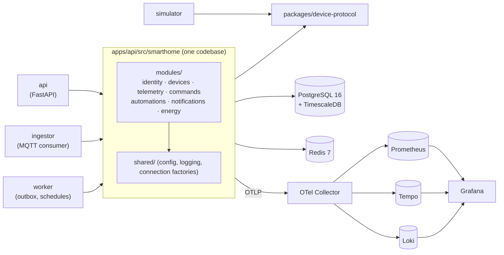

# Smart Home Hub

A multi-tenant smart home hub built to show **event-driven design, real-time
telemetry, time-series storage, device security and observability**. Real hardware
is optional: a simulator speaks the same MQTT protocol a real ESP32 would.

> **Status:** phase 5 of 11 (devices and provisioning). Most of the product below is still on the roadmap.
> [Versão em português](README.pt-BR.md).

## What it will do

- Register and control devices: lights, plugs, thermostat, lock, presence, door/window,
  temperature/humidity, energy meter and a simulated camera.
- Ingest telemetry over MQTT 5 (TLS, per-device credentials and ACLs) into TimescaleDB.
- Keep a **digital twin** (desired/reported) per device, with command acks and timeouts.
- Run **automations** from a versioned JSON DSL, with loop protection and dry-run
  against history.
- Show a live SVG floor plan in a React PWA over WebSocket.
- Trace every action end to end: click → API → MQTT → device → ack → WebSocket.

## Architecture (so far)

A modular monolith with three entrypoints. See
[ADR 0001](docs/adr/0001-modular-monolith-with-multiple-entrypoints.md).



Module boundaries are enforced in CI by [import-linter](apps/api/.importlinter).
Every module owns one Postgres schema, with no foreign keys across schemas.

## Run it

Requirements: Docker with Compose v2, plus Python ≥ 3.12, Poetry ≥ 2.2 and Node ≥ 22
for local development.

```bash
make up          # builds and starts everything, waits for healthchecks
curl localhost:8000/health/ready
make down
```

| Service    | URL / port                     | Notes                                          |
|------------|--------------------------------|------------------------------------------------|
| API        | http://localhost:8000          | `/health/live`, `/health/ready`, `/docs`       |
| PostgreSQL | `localhost:15432`              | TimescaleDB 2.30, credentials in `.env`        |
| Redis      | `localhost:16379`              |                                                |
| Web (dev)  | http://localhost:5173          | `make web-dev`, not containerised yet          |
| Keycloak   | http://localhost:8080          | realm `smarthome`; admin password in `.env`    |
| MQTT (TLS) | `localhost:8883`               | Mosquitto; dev CA in `infra/mqtt/certs/ca.crt` |
| Grafana    | http://localhost:3000          | anonymous viewer; admin password in `.env`     |
| Prometheus | http://localhost:9090          | OTLP receiver + exemplar storage               |
| Tempo      | http://localhost:3200          | traces; metrics-generator → Prometheus         |
| Loki       | http://localhost:3100          | logs over native OTLP                          |
| OTel Collector | `localhost:4317` (gRPC), `localhost:4318` (HTTP) | single entry point for telemetry |

Host ports are offset from the defaults so the stack can run next to other local projects.
Override them in `.env`.

## Sign in

```bash
make up && make web-dev      # the web app proxies /api to the BFF
```

Open http://localhost:5173 and sign in. Dev users (password `smarthome-dev-1`):
`alice`, `bob`, `carol`, `dave`. Any of them can create a home and invite the others
as resident, guest (with expiry and device scope) or viewer.

How it works: the API is a **backend-for-frontend**. The browser only ever holds an
`HttpOnly; Secure; SameSite=Strict` session cookie, tokens stay server-side, refresh
tokens rotate, and unsafe requests need a CSRF token ([ADR 0003](docs/adr/0003-bff-sessions-and-csrf.md)).
Homes are tenants with per-home roles and a hash-chained, append-only audit log
([ADR 0004](docs/adr/0004-tenancy-roles-and-audit-log.md)).

## Simulated devices

```bash
make up
make simulate                     # first run pairs 3 homes x 20 devices, then runs them
make simulate SPEED=600           # a simulated day passes in 2.4 minutes
make simulate-reset               # forget the fleet; the next run pairs a new one
```

The first `make simulate` creates three homes owned by `alice`, with one pairing code
per device, and then **every simulated device pairs itself over HTTP**
(`POST /provisioning/claim`), the same way a real ESP32 would. Each device gets its own
broker credentials. Sign in as alice to see them; `GET /homes/{id}/devices` shows
presence (fed by the ingestor and the devices' Last Will) and each device's twin
([ADR 0006](docs/adr/0006-device-provisioning-credentials-and-twin.md)).

Devices speak [protocol v1](docs/device-protocol.md) over MQTT 5 + TLS, each with its own
credentials and an ACL limited to its own topics ([ADR 0005](docs/adr/0005-mqtt-broker-and-qos.md)).
The simulator models a day in each home: outdoor temperature, sunlight, residents coming
and going, lights following presence and darkness, a fridge compressor cycle, a washer run.
It also injects faults: dropped connections (seen through the Last Will), noisy readings,
malformed payloads and draining batteries.

## Tour: follow one request through every signal

```bash
make up
make demo-traffic            # 2 minutes of mixed traffic: fast, slow and failing requests
curl -s localhost:8000/diagnostics/trace-demo   # returns the trace_id of this request
```

1. Open **Grafana → Smart Home → Service Overview** (http://localhost:3000). You will see
   request rate, 5xx ratio, p50/p95/p99 latency, in-flight requests, the DB pool and
   process CPU/memory.
2. On *Latency percentiles*, hover a dot (an **exemplar**) and click **View trace**. Tempo
   opens the exact request: `GET /diagnostics/trace-demo` → Redis `INCRBY` → Postgres
   `SELECT` → `diagnostics.simulated_work`.
3. In the trace view, click **Logs for this span**. Loki shows the log line emitted inside
   that request, matched by `trace_id`.
4. Go the other way: in *Warnings and errors*, expand a `trace_demo_failed` line and follow
   its `trace_id` link back to Tempo.
5. **Explore → Tempo → Service Graph** shows the dependency map derived from spans.

How it is wired: [ADR 0002](docs/adr/0002-observability-pipeline.md).

## Develop

```bash
make install     # poetry install in every Python app + npm ci
make check       # ruff, import-linter, mypy --strict, eslint, tsc
make check-infra # validates compose, collector, Prometheus, Tempo, Loki and dashboards
make test-unit   # no containers
make test-it     # real TimescaleDB + Redis via Testcontainers
make help        # everything else
```

## Repository layout

```
apps/
  api/          FastAPI app + every domain module (the monolith)
  ingestor/     MQTT ingestion entrypoint over the same modules
  worker/       background entrypoint over the same modules
  simulator/    simulated homes and devices (depends only on device-protocol)
  web/          React + TypeScript (Vite)
packages/
  device-protocol/   MQTT topics and message schemas
  contracts/         OpenAPI + generated TS client
infra/          docker compose and service configs
docs/adr/       architecture decision records (MADR)
scripts/        repo tooling (import contract generator)
```

## Roadmap

1. ✅ Foundation: monorepo, CI, compose, module boundaries
2. ✅ Observability: OTel Collector, Prometheus, Grafana, Tempo, Loki
3. ✅ Identity and auth: Keycloak, BFF, roles, guests, audit log
4. ✅ Device protocol and MQTT broker with TLS and ACLs, basic simulator
5. ✅ Devices and provisioning: pairing, credentials, twin, LWT
6. Telemetry: batched ingestion, hypertables, continuous aggregates
7. Commands: ack, timeout, idempotency, trace propagation over MQTT
8. Automations: DSL, rule engine, scenes, schedules, dry run
9. Frontend: live floor plan, automation editor, history, PWA
10. Energy, notifications, dashboards, alerts, load test
11. Diagrams, remaining ADRs, threat model, ASVS checklist, E2E. Then a real ESP32.
