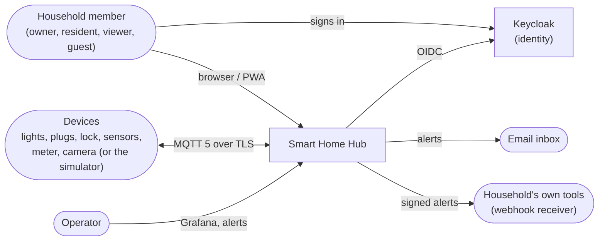
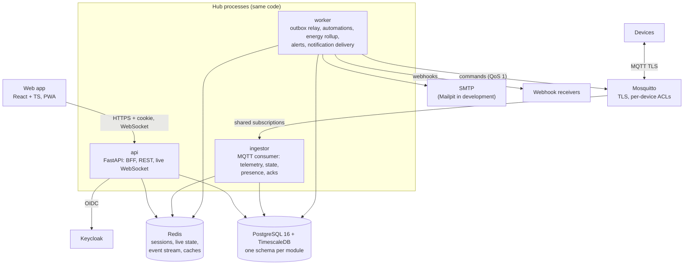
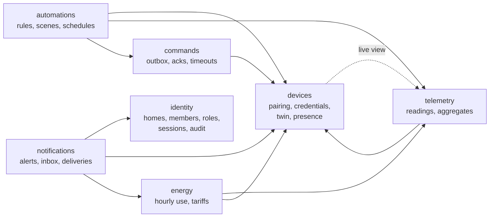
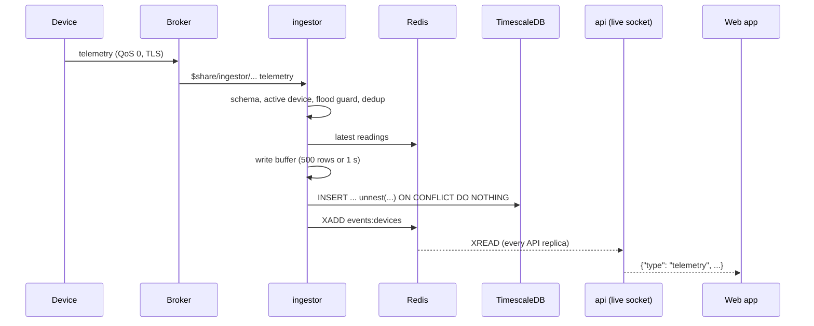
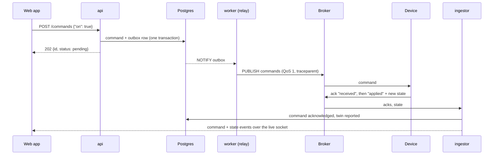
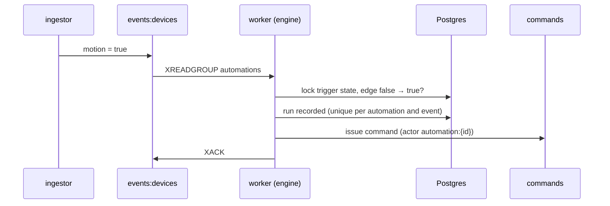
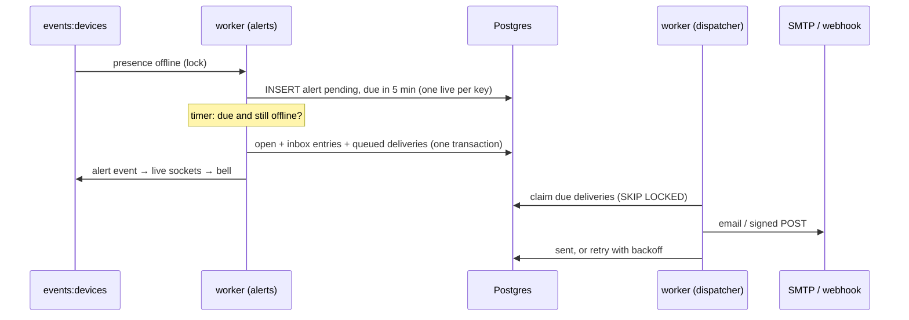
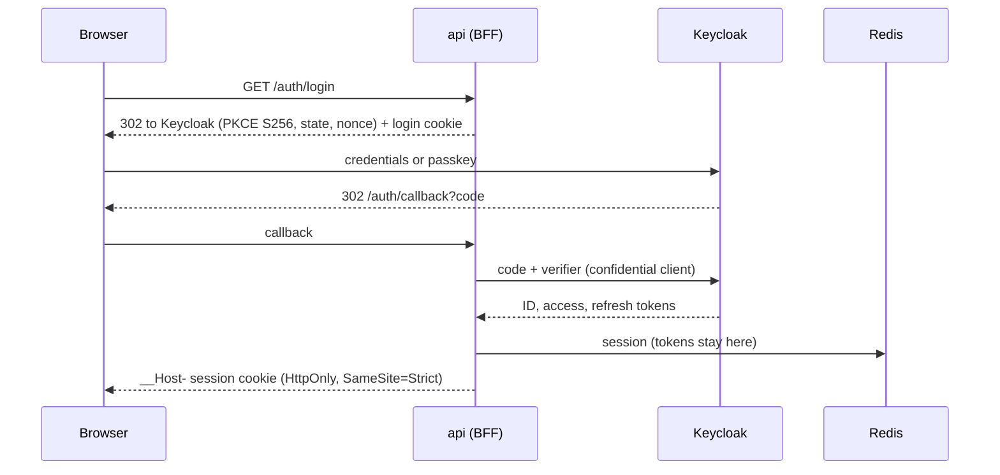

# Architecture

How the hub fits together, from the outside in. Decisions and their trade-offs are in
the [ADRs](adr/); security in the [threat model](security/threat-model.md).

## Context

## Containers

One codebase (`apps/api/src/smarthome`), three entrypoints, each its own process and
image tag ([ADR 0001](adr/0001-modular-monolith-with-multiple-entrypoints.md)).

Not drawn: every process sends traces, metrics and logs over OTLP to the OpenTelemetry
Collector, which feeds Prometheus, Tempo and Loki behind Grafana; Prometheus alert rules
go to Alertmanager ([ADR 0002](adr/0002-observability-pipeline.md)).

| Process | Does | Scales by |
|---|---|---|
| `api` | BFF (login, session, CSRF), REST for every module, one live WebSocket per open home | replicas (stateless; each tails the event stream) |
| `ingestor` | validates device messages, writes telemetry in batches, updates twins and presence, records command acks, publishes device events | replicas (MQTT shared subscriptions for telemetry and acks) |
| `worker` | publishes the command outbox, expires commands, runs automations (event stream consumer group, timers, schedules), energy rollup, alerts and their deliveries | replicas (consumer groups, `SKIP LOCKED`, advisory locks) |

## Modules

Each module owns a Postgres schema, exposes `public.py` and nothing else; the domain
layer imports no framework. Both rules are checked in CI (import-linter).

An arrow means "reads through the other module's `public.py`". Every module's HTTP
layer also checks access through `identity` (not drawn). No foreign keys cross
schemas; the device event stream (`shared/events`) carries changes between them without
coupling producers to consumers.

## Where data lives

| Data | Store | Why there | ADR |
|---|---|---|---|
| Homes, members, invitations, audit log | Postgres `identity`, `audit` | transactional, hash-chained audit | 0004 |
| Devices, twins, pairing codes | Postgres `devices` | configuration of record | 0006 |
| Readings | TimescaleDB hypertable + 1 m / 1 h / 1 d continuous aggregates | time series, compression, retention | 0007 |
| Latest readings, presence, reported state | Redis | read on every screen, written on every message | 0008 |
| Commands, outbox | Postgres `commands`, `outbox` | written in the same transaction | 0009 |
| Device events | Redis stream `events:devices` | buffer between "changed" and "react" | 0010 |
| Automations, runs, scenes | Postgres `automations` | versioned configuration, run history | 0010 |
| Hourly energy, tariffs | Postgres `energy` | outlives raw telemetry, exact money | 0012 |
| Alerts, inbox, delivery queue | Postgres `notifications` | uniqueness and transactions decide | 0013 |
| BFF sessions (with OAuth tokens) | Redis, keyed by hashed session id | short-lived, shared by API replicas | 0003 |

## Flows

### A reading, from device to screen

### A command, from click to light

One trace covers every hop, including the device (W3C trace context in MQTT 5 user
properties, [ADR 0009](adr/0009-commands-outbox-and-trace-propagation.md)).

### An automation

### An alert

### Signing in (BFF)

