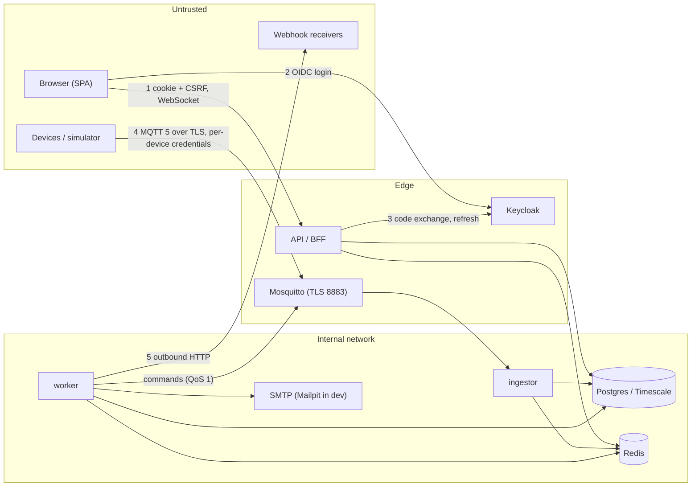

# Threat model

STRIDE per trust boundary, for the hub as it runs today (`make up`). Every mitigation
points at the code or test that implements it; every open risk says why it is open.
Reviewed 2026-10-03 (phase 11). Requirement-by-requirement evidence:
[ASVS mapping](asvs.md).

## What we protect

| Asset | Why it matters |
|---|---|
| **Physical control**: locks, cameras (arm/disarm) | A forged or replayed command opens a door. |
| **Occupancy data**: presence, motion, contact sensors, energy | Telemetry reveals when a home is empty. |
| **Credentials**: BFF sessions, OAuth tokens, device MQTT passwords, pairing codes, webhook secrets | Each one is a way in. |
| **Audit log** | Who unlocked what must stay answerable. |
| **Availability** of ingestion, commands, automations, alerts | A hub that stops reacting fails at its job, including security alerts. |

## Who might attack

- **Anyone on the internet**, if the BFF is exposed: no account, or a Keycloak account
  that is not a member of the target home.
- **A member with less power**: a viewer, or a guest whose pass covers some devices and
  expires.
- **A compromised or cloned device** holding valid MQTT credentials.
- **A home owner** configuring a webhook that points inside the hub's network (SSRF).
- **Someone on the same LAN** (the MQTT port listens on it by design).
- **An insider with database or Redis access**.

## Trust boundaries

## Threats and mitigations

### 1. Browser ↔ BFF

| STRIDE | Threat | Mitigation | Evidence |
|---|---|---|---|
| S | Stolen session token from JS (XSS) | Tokens never reach the browser; session is an opaque `HttpOnly`, `Secure`, `SameSite=Strict`, `__Host-` cookie; session ids are stored as sha256 in Redis | ADR 0003; `identity/api/bff.py`; `identity/infrastructure/sessions.py` |
| S | Login CSRF / code injection | PKCE S256, `state` bound to a short-lived login cookie, `return_to` restricted to same-origin paths | `identity/infrastructure/oidc.py`; `tests/unit/identity/test_bff.py` |
| T | Cross-site request forgery | `SameSite=Strict` **and** an `X-CSRF-Token` header **and** an `Origin` allow-list on unsafe methods | `identity/api/dependencies.py`; integration tests (CSRF 403, cross-origin 403) |
| T | Cross-site WebSocket hijacking | `Origin` checked at the handshake (refused before accept); session and membership re-checked every 60 s on open sockets | ADR 0011; `tests/integration/live/test_live_socket.py` |
| T | Lost update on concurrent edits | `ETag` / `If-Match` on automations, scenes, tariffs (428/412) | ADR 0014; API tests |
| R | "I never unlocked it" | Critical commands audited (issued and outcome) in an append-only, per-home hash-chained log; trigger forbids UPDATE/DELETE | ADR 0004; `tests/integration/test_audit_log.py` |
| I | Probing other homes | Non-members get `404`, same as a missing home; live sockets closed with 4403 without data | ADR 0004, 0011; E2E `someone who is not a member…` |
| I | Guest sees beyond their pass | Device scope enforced on reads, commands, live events; home-wide data (energy, home alerts) refused to scoped guests | `require_device_access`; energy and alerts API tests |
| I | Sensitive data cached | `Cache-Control: no-store`, strict CSP (`default-src 'none'`), `nosniff`, `no-referrer`, COOP/CORP | `shared/http/security_headers.py` |
| E | Viewer or guest acts beyond role | Permission matrix per role, checked per request; an automation never grants more than its author holds | `identity/domain/model.py`; automations `authorize()` |
| E | Stale sign-in operates a lock | Locks and cameras need `operate_locks` **and** an authentication from the last 5 minutes (step-up through `prompt=login`) | ADR 0009; commands tests |
| D | Request floods | Pairing claims rate-limited per IP; per-socket bounded queue (slow clients closed with 1013) | `shared/http/rate_limit.py`; live tests |

### 2. Identity provider

| STRIDE | Threat | Mitigation | Evidence |
|---|---|---|---|
| S | Password guessing | Keycloak brute-force detection, password policy (12+ chars, not username/email), passkeys enabled | `infra/keycloak/realm-export.json` |
| S | Forged ID token | Signature checked against JWKS, issuer, audience, expiry, nonce | `oidc.py`; `tests/unit/identity/test_oidc.py` |
| T/I | Refresh token reuse | Rotation with revocation; one refresh at a time per session (Redis lock) | realm `revokeRefreshToken`; `tests/integration/identity/test_sessions_redis.py` |

### 3. Devices ↔ broker ↔ hub

| STRIDE | Threat | Mitigation | Evidence |
|---|---|---|---|
| S | Device impersonation | TLS-only listener, no anonymous access, one random 256-bit password per device (shown once at pairing); hub accounts separate from device accounts | ADR 0005, 0006; `tests/integration/broker/test_broker_security.py` |
| S | Pairing code guessing | 40-bit single-use codes, stored as sha256, 10-minute TTL; claims limited per IP per minute and to 20 failures per IP per hour. Even 10,000 IPs get ~2·10⁵ guesses an hour against 2⁴⁰ codes | `devices/domain/model.py`, `devices/api/routes.py`; claim race test |
| T | A device publishes for another device or home | Per-device dynamic-security ACL: its own topics only (QoS 1 publish to others gets reason 0x87) | broker security tests |
| T | Forged command to a lock | Only the hub's worker account may publish commands; devices subscribe to their own command topic only | broker ACL; ADR 0009 |
| T | Malformed or hostile payloads | JSON Schema validation per message type before anything is stored; unknown devices and inactive devices ignored | `device_protocol`; ingestor tests |
| R | Device denies a command | Acks recorded with the command's trace id; late acks cannot change a settled command | ADR 0009 |
| I | Eavesdropping on the LAN | TLS on MQTT | `infra/mqtt/mosquitto.conf` |
| D | A device floods telemetry | Per-device rate limit → automatic quarantine (broker credentials disabled); bounded write buffer with back-pressure | ADR 0007; quarantine tests; [load test](../load-test.md) |
| E | Revoked device keeps its connection | Revocation disables the broker client first and kicks the live connection, then updates the database | ADR 0006; revoke-kicks test |

### 4. Hub → outside world (webhooks, email)

| STRIDE | Threat | Mitigation | Evidence |
|---|---|---|---|
| S | Receiver accepts forged alerts | HMAC-SHA256 signature over timestamp and body; replay window 5 min; secret shown once, rotatable | ADR 0013; [guide](../notifications.md); webhook tests |
| I/E | SSRF: an owner points the webhook at internal services or cloud metadata | Outside development: `https` only, no credentials in URL, every resolved address must be public; checked on save **and** before each send; redirects not followed | `notifications/infrastructure/senders.py`; `tests/unit/notifications/test_address_guard.py` |
| I | Secrets in logs | httpx no longer logs request URLs; audit records only the webhook host | `shared/logging.py`; `tests/unit/test_logging.py` |
| D | Notification storms | One live alert per condition (unique index); emails rate-limited per address; queue with backoff | ADR 0013 |

### 5. Data stores and the internal network

| STRIDE | Threat | Mitigation | Evidence |
|---|---|---|---|
| S/I | Another process on the developer's machine or LAN reads Redis or Postgres | Published ports bind to `127.0.0.1` by default (MQTT excepted); Redis requires a password | `infra/docker-compose.yml`, `.env.example` (`PUBLISH_HOST`, `REDIS_PASSWORD`) |
| T | Audit log rewritten | Append-only trigger and hash chain with verification endpoint | ADR 0004 |
| T | Money or energy totals corrupted by concurrent writers | Advisory locks and idempotent recomputation | ADR 0012 tests |
| E | Container escape blast radius | Images run as UID 10001, read-only root filesystem, all capabilities dropped, `no-new-privileges` | `apps/api/Dockerfile`, compose |
| — | Vulnerable dependencies | `pip-audit`, `npm audit`, Trivy (filesystem + image) on every PR | `.github/workflows/security.yml` |

## Open risks

Ordered by what we would fix first. None is hidden by the mitigations above.

| # | Risk | Why it is open | Next step |
|---|---|---|---|
| R1 | **The applications connect to Postgres as the database owner.** A SQL injection (none known: every query is parameterised) or a stolen app credential could disable the audit trigger or drop tables. | TimescaleDB policies (retention) are applied by the ingestor at startup and need ownership. | Separate a migration/owner role from a DML-only application role; move retention to the `migrate` job. |
| R2 | **Webhook secrets and OAuth tokens are stored in clear** (Postgres and Redis respectively). | The hub must sign with the webhook secret and refresh with the token, so they cannot be hashed. Redis is now password-protected, Postgres is not exposed. | Envelope-encrypt both with a key from a secret manager. |
| R3 | **DNS rebinding** can move a webhook host to an internal address between the SSRF check and the connection. | The check runs at save and before each send, which narrows but does not close the window. | Connect to the address that was checked (custom transport pinning the IP, with SNI set to the host name). |
| R4 | **No TLS on the HTTP edge in development**; the `Secure` cookie relies on browsers treating `localhost` as secure. | Production is expected behind a TLS-terminating proxy; HSTS is already sent. | Document and test a deployment profile with TLS (Caddy/Traefik). |
| R5 | **Device passwords never rotate**; a cloned device works until revoked. | Rotation needs a firmware flow (devices store one credential). | Credential rotation over the command channel with overlap; or client certificates per device. |
| R6 | **Rate limits are per process / per IP only for pairing.** Authenticated API calls are not rate-limited. | Sessions are expensive to obtain (Keycloak brute-force protection) and every request is authorised; the [load test](../load-test.md) shows the API saturating a core at ~216 req/s. | Per-session token bucket in Redis at the BFF. |
| R7 | **Email is delivered at least once**; a duplicate alert email is possible. | Accepted in ADR 0013 (webhooks carry an Idempotency-Key). | None planned. |
| R8 | **One Keycloak realm, dev users with a shared password** in the repository. | Development fixture only; the realm export is for local use. | Production realms are created without users; documented in the README. |
